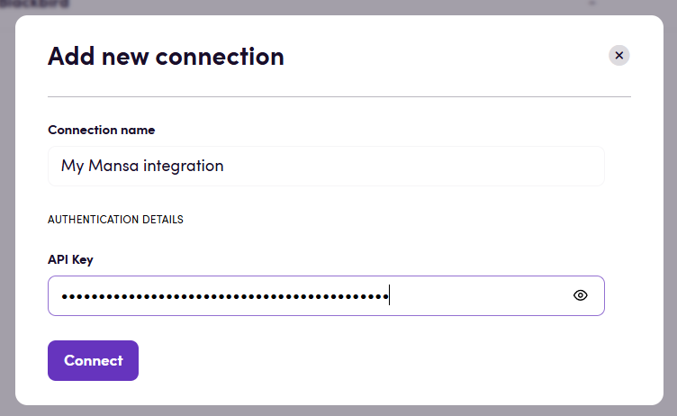

# Blackbird.io mansa

Blackbird is the new automation backbone for the language technology industry. Blackbird provides enterprise-scale automation and orchestration with a simple no-code/low-code platform. Blackbird enables ambitious organizations to identify, vet and automate as many processes as possible. Not just localization workflows, but any business and IT process. This repository represents an application that is deployable on Blackbird and usable inside the workflow editor.

## Introduction

<!-- begin docs -->

Mansa is an AI-powered translation platform specializing in African languages, offering high-quality, context-aware translations across more than 20 languages.

## Before setting up

Before you can connect you need to make sure that:

- You have an API key for Mansa. If you don't: 

1. Create an account in https://all-lab-portal.com/sign-in
This gives you access to your workspace and API management tools.

2. Generate an API Key
From the user dashboard, create a new API key.
This key authenticates all requests to the Mansa API.

## Connecting

1. Navigate to Apps, and identify the Mansa app. You can use search to find it.
2. Click _Add Connection_.
3. Name your connection for future reference e.g. 'My Mansa connection'.
4. Fill in the API key to your Mansa account.
5. Click _Connect_.

## Actions

### Translation

- **Translate** Translate interopability compatible files in Blackbird
  interoperability mode. If you're only translating text (strings) then use _Translate
  text_ instead. Advanced settings:
  - **Output file handling**: If using Blackbird's interoperability mode, this
    determines the format of the output file. The default Blackbird behavior is
    to convert to XLIFF for future steps. You can change it to output the
    original file format (if you don't want to continue language operationts
    after this step).
  - **Context**: Add additional context to the translation, this can be anything
    of relevance.
  - **Creativity**: Randomness level (0.1–1.0, defaults to 0.7).   
- **Translate text** Translate a single text string. Useful when translating
  small messages. For larger content and files use _Translate_ instead.

## Example

The example above shows a Bird that is triggered as soon as an entry is
published in Contentful, said entry is then exported and
translated through Mansa before being imported back into Contentful.

## Feedback

Do you want to use this app or do you have feedback on our implementation? Reach out to us using the [established channels](https://www.blackbird.io/) or create an issue.

<!-- end docs -->
